# Damas Clash

**Damas Clash** is a mobile app for playing Brazilian Draughts (Damas Brasileiras) with real Bitcoin stakes over the Lightning Network. Sign in with your Google account or Nostr identity, challenge other players online, and win sats.

**[damas.clashapps.com](https://damas.clashapps.com)**

---

## Screenshots

<p align="center">
  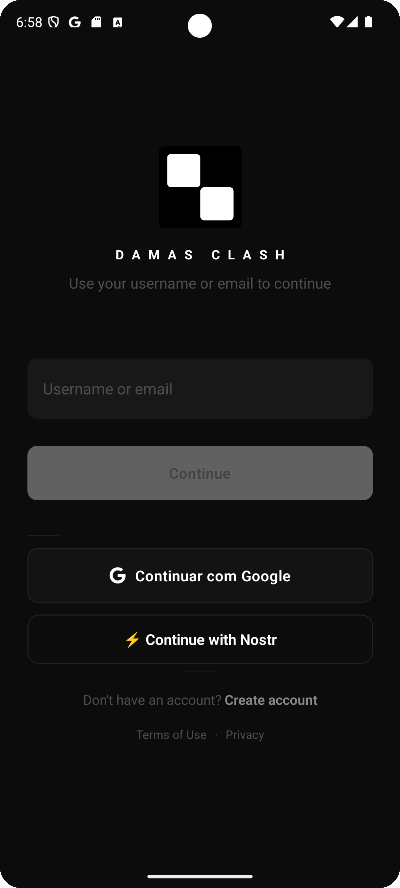
  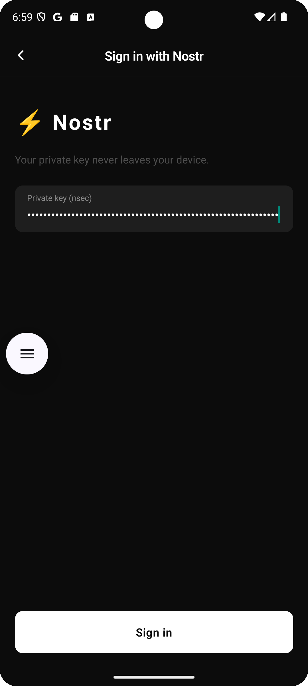
  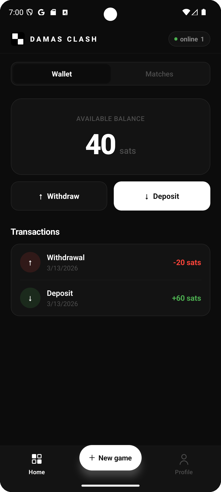
  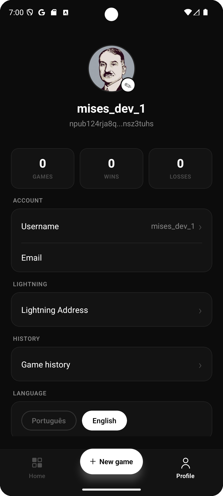
</p>
<p align="center">
  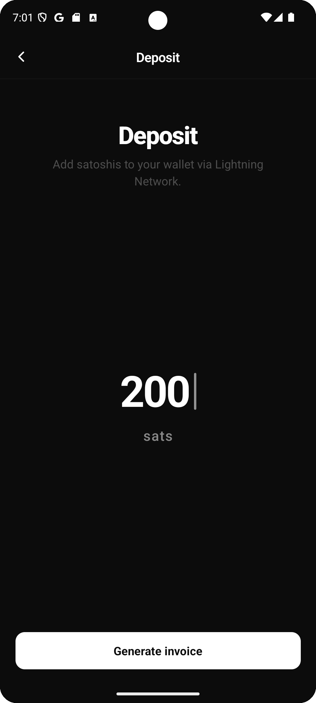
  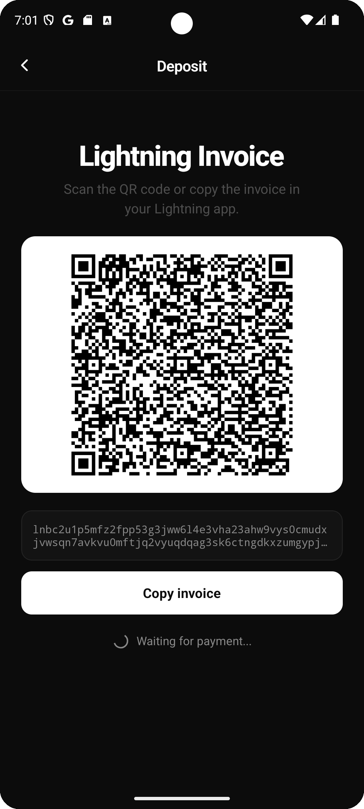
  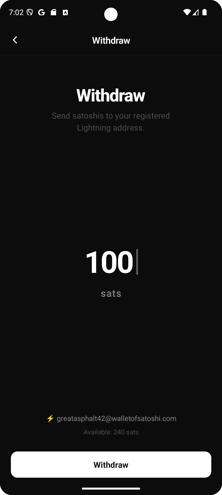
  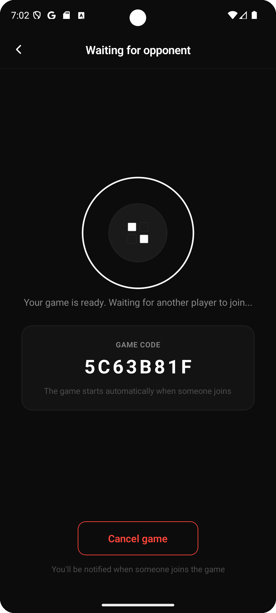
</p>
<p align="center">
  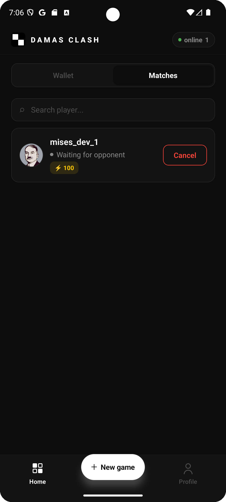
  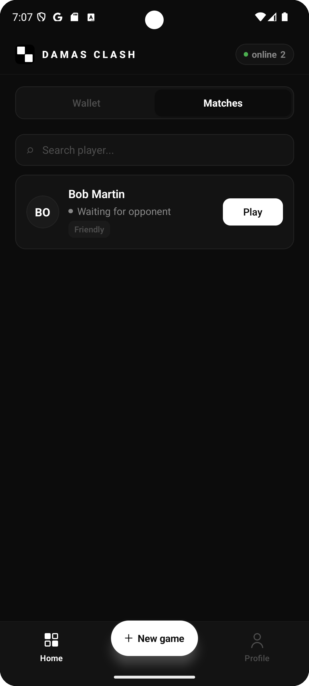
  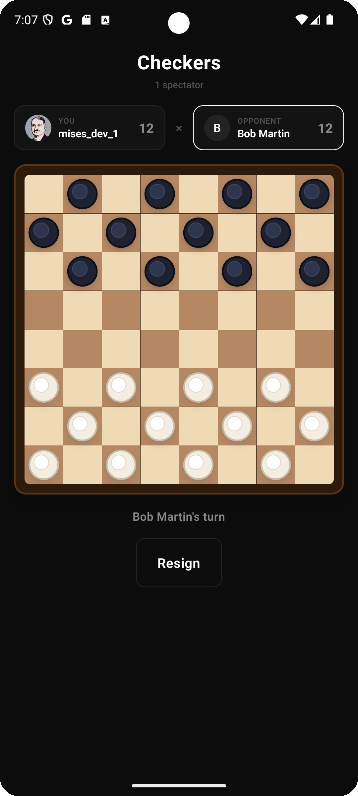
  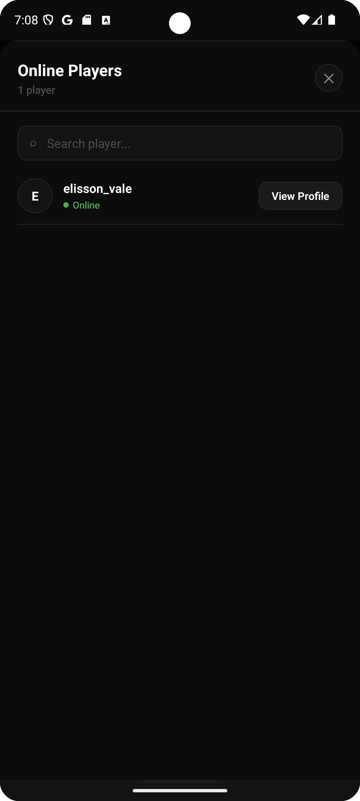
</p>

---

## Features

### Authentication
- Sign in with **email/password**, **Google**, or **Nostr** (nsec private key — never leaves your device)
- Email confirmation with 6-digit OTP code

### Brazilian Draughts (Damas Brasileiras)
- Full rule implementation: mandatory capture, multi-capture, long-range kings, promotion rules
- Real-time multiplayer via **SignalR** WebSockets
- Spectator support — watch live games
- Friendly matches or **sats-staked** games
- Waiting room with shareable game code
- Resign at any time

### Bitcoin Lightning Wallet
- Built-in custodial wallet denominated in **satoshis**
- Deposit via **Lightning invoice** (QR code + copy)
- Withdraw to any **Lightning address**
- Full transaction history

### Social
- Live **online players** list with search
- Player profiles with game stats (games, wins, losses)
- Custom avatar (photo or initials)
- Real-time lobby — game list updates instantly as players create or join matches

### Profile & Settings
- Edit username and email
- Register a Lightning address for withdrawals
- Language selector: **Português / English**
- Nostr public key (npub) displayed on profile

---

## Tech Stack

| Layer | Stack |
|---|---|
| Mobile | React Native 0.84, TypeScript, React 19 |
| Real-time | SignalR (`@microsoft/signalr`) |
| Auth | JWT + Google OAuth + Nostr (nsec) |
| Payments | Bitcoin Lightning Network |
| Backend | .NET 10, ASP.NET Core, EF Core 9, PostgreSQL |
| Cache | Redis |
| Storage | Cloudinary (avatars) |

---

## Running Locally

### Prerequisites

- Node.js 18+
- React Native environment set up ([guide](https://reactnative.dev/docs/set-up-your-environment))
- Android Studio and/or Xcode
- .NET 10 SDK
- Docker & Docker Compose

### 1. Start the backend

```bash
docker compose up -d
```

This starts PostgreSQL and the API on `http://localhost:8080`.

### 2. Install mobile dependencies

```bash
cd appmobile
npm install
```

### 3. Run on Android

```bash
cd appmobile
npm run android
```

### 4. Run on iOS

```bash
cd appmobile
bundle exec pod install --project-directory=ios
npm run ios
```

### 5. Run tests

```bash
# API tests (no database required)
cd api.tests
dotnet test --filter "Category!=Integration"

# Mobile tests
cd appmobile
npx jest
```

---

## Configuration

The mobile app connects to `http://10.0.2.2:8080` by default (Android emulator localhost). To point to a different backend, update `BASE_URL` in `appmobile/src/api/client.ts`.

For Google Sign-In, set your `GOOGLE_WEB_CLIENT_ID` in the Android build environment before running.
